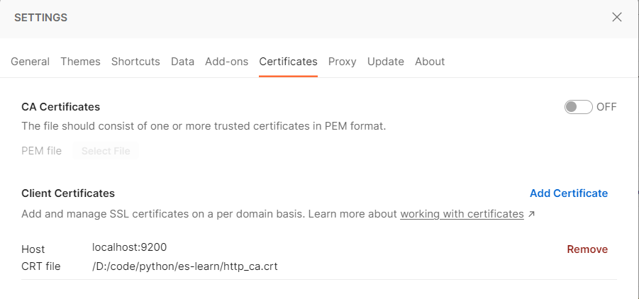
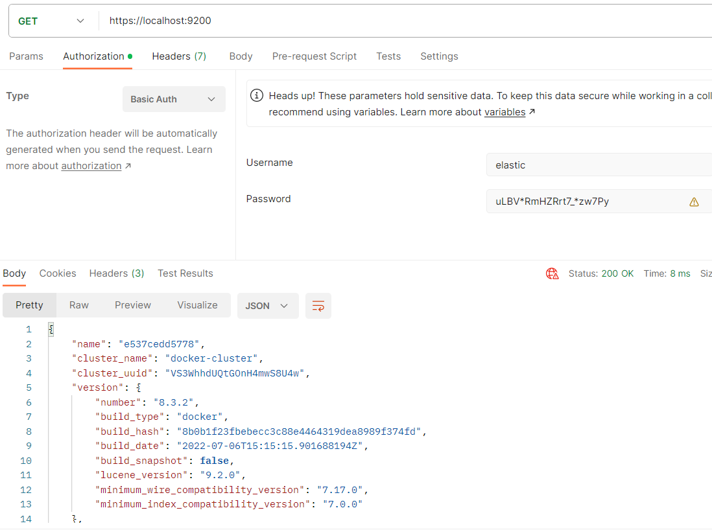

# Docker安装Elasticsearch8

本人使用的Elasticsearch版本是8.3.2。

Windows基于WSL2的Docker Desktop，版本24.0.6。

```shell
docker pull elasticsearch:8.3.2
docker pull kibana:8.3.2
```

docker-compose.yml

下面配置未指定es的配置文件，es启动后会默认生成。

```yaml
version: "3"
services:
  es:
    image: elasticsearch:8.3.2
    container_name: es
    networks:
      - elastic
    ports:
      - "9200:9200"
      - "9300:9300"
    volumes:
      - ./volumes/data:/usr/share/elasticsearch/data
      - ./volumes/plugins:/usr/share/elasticsearch/plugins
    environment:
      discovery.type: single-node
  kibana:
    image: kibana:8.3.2
    container_name: kibana
    networks:
      - elastic
    ports:
      - "5601:5601"
    depends_on:
      - es
networks:
  elastic:
```

此时如果直接浏览器打开http://localhost:9200，无法看到elasticsearch的状态信息。

使用docker单节点模式安装es8，默认启动安全配置。

- 生成证书和密钥
- TLS加密配置会写入到elasticsearch.yml
- 为elastic用户生成密码
- 为kibana生成注册令牌

要正常访问es需要ca证书以及用户名密码。

ca证书

```shell
docker cp es:/usr/share/elasticsearch/config/certs/http_ca.crt .
```

按照官方的说法，用户密码和注册令牌仅会在es第一次启动时打印在控制台，但是本人发现并没有。

```json
{"@timestamp":"2023-10-18T07:21:27.922Z", "log.level": "INFO", "message":"Auto-configuration will not generate a password for the elastic built-in superuser, as we cannot  determine if there is a terminal attached to the elasticsearch process. You can use the `bin/elasticsearch-reset-password` tool to set the password for the elastic user.", "ecs.version": "1.2.0","service.name":"ES_ECS","event.dataset":"elasticsearch.server","process.thread.name":"main","log.logger":"org.elasticsearch.xpack.security.InitialNodeSecurityAutoConfiguration","elasticsearch.node.name":"e537cedd5778","elasticsearch.cluster.name":"docker-cluster"}
```

密码和令牌可以使用es的脚本生成。

```shell
docker exec -it es /usr/share/elasticsearch/bin/elasticsearch-reset-password -u elastic
docker exec -it es /usr/share/elasticsearch/bin/elasticsearch-create-enrollment-token --scope kibana
```

```shell
curl --cacert http_ca.crt -u elastic:uLBV*RmHZRrt7_*zw7Py https://localhost:9200
{
  "name" : "e537cedd5778",
  "cluster_name" : "docker-cluster",
  "cluster_uuid" : "VS3WhhdUQtGOnH4mwS8U4w",
  "version" : {
    "number" : "8.3.2",
    "build_type" : "docker",
    "build_hash" : "8b0b1f23fbebecc3c88e4464319dea8989f374fd",
    "build_date" : "2022-07-06T15:15:15.901688194Z",
    "build_snapshot" : false,
    "lucene_version" : "9.2.0",
    "minimum_wire_compatibility_version" : "7.17.0",
    "minimum_index_compatibility_version" : "7.0.0"
  },
  "tagline" : "You Know, for Search"
}
```

查看自动生成的es配置文件

```shell
docker cp es:/usr/share/elasticsearch/config/elasticsearch.yml .
```

```yaml
cluster.name: "docker-cluster"
network.host: 0.0.0.0

#----------------------- BEGIN SECURITY AUTO CONFIGURATION -----------------------
#
# The following settings, TLS certificates, and keys have been automatically      
# generated to configure Elasticsearch security features on 18-10-2023 07:21:12
#
# --------------------------------------------------------------------------------

# Enable security features
xpack.security.enabled: true

xpack.security.enrollment.enabled: true

# Enable encryption for HTTP API client connections, such as Kibana, Logstash, and Agents
xpack.security.http.ssl:
  enabled: true
  keystore.path: certs/http.p12

# Enable encryption and mutual authentication between cluster nodes
xpack.security.transport.ssl:
  enabled: true
  verification_mode: certificate
  keystore.path: certs/transport.p12
  truststore.path: certs/transport.p12
#----------------------- END SECURITY AUTO CONFIGURATION -------------------------
```

## 在Postman中访问es

1. postman中配置刚刚从es中复制的ca证书，settings->Certificates，配置域名、端口、ca证书。

   

2. HTTP请求添加Basic Auth，每个请求的Authorization选择Basic Auth，输入用户名密码。

   

## Python Client

```python
from pprint import pprint

# 8.3.2
from elasticsearch import Elasticsearch

es_password = 'yq7UbfMeNNGkvFh2gBf_'

client = Elasticsearch(hosts='http://localhost:9200',
                       # ca_certs=os.path.join(os.path.dirname(__file__), 'http_ca.crt'),
                       basic_auth=('elastic', es_password))

pprint(client.info().body)
pprint(client.perform_request('POST', '/_analyze',
                              headers={'Content-Type': "application/vnd.elasticsearch+json;compatible-with=8",
                                       "Accept": "application/vnd.elasticsearch+json;compatible-with=8"},
                              body={
                                  'text': '黑马程序员的Java和Python教的真不错，很好用',
                                  "analyzer": "ik_max_word"
                              }).body)
```

## Java Client

本人在Springboot2.7.16项目中使用访问es，对应Springdata使用的es版本是7.17，使用Rest-High-Level-Client Api，8.x此Client已不再维护，官方推荐[Java Client Api](https://www.elastic.co/guide/en/elasticsearch/client/java-api-client/8.3/indexing.html)，引入和es版本对应的该包。

```xml
<dependency>
    <groupId>co.elastic.clients</groupId>
    <artifactId>elasticsearch-java</artifactId>
    <version>8.3.2</version>
</dependency>
<!-- https://mvnrepository.com/artifact/jakarta.json/jakarta.json-api -->
<dependency>
    <groupId>jakarta.json</groupId>
    <artifactId>jakarta.json-api</artifactId>
    <version>2.0.1</version>
</dependency>
```

Elasticsearch Config配置类

```java
import co.elastic.clients.elasticsearch.ElasticsearchClient;
import co.elastic.clients.json.jackson.JacksonJsonpMapper;
import co.elastic.clients.transport.ElasticsearchTransport;
import co.elastic.clients.transport.rest_client.RestClientTransport;
import org.elasticsearch.client.RestClient;
import org.springframework.boot.autoconfigure.elasticsearch.ElasticsearchProperties;
import org.springframework.context.annotation.Bean;
import org.springframework.context.annotation.Configuration;
import org.springframework.data.elasticsearch.client.ClientConfiguration;
import org.springframework.data.elasticsearch.client.elc.AutoCloseableElasticsearchClient;
import org.springframework.data.elasticsearch.client.elc.ElasticsearchConfiguration;
import org.springframework.lang.NonNull;

import java.net.URI;
import java.util.ArrayList;
import java.util.List;

/**
 * @author chunf
 */

@Configuration
public class MyElasticsearchConfiguration extends ElasticsearchConfiguration {
   private final ElasticsearchProperties elasticsearchProperties;

   MyElasticsearchConfiguration(ElasticsearchProperties elasticsearchProperties) {
      this.elasticsearchProperties = elasticsearchProperties;
   }

   @Override
   @NonNull
   @Bean
   public ClientConfiguration clientConfiguration() {
      List<String> uris = elasticsearchProperties.getUris();
      List<String> hostAndPort = new ArrayList<>();
      for (String s : uris) {
         URI uri = URI.create(s);
         hostAndPort.add(uri.getHost() + ":" + uri.getPort());
      }

      return ClientConfiguration
              .builder()
              .connectedTo(hostAndPort.toArray(new String[0]))
              .withBasicAuth(elasticsearchProperties.getUsername(), elasticsearchProperties.getPassword())
              .withPathPrefix(elasticsearchProperties.getPathPrefix())
              .withConnectTimeout(elasticsearchProperties.getConnectionTimeout())
              .withSocketTimeout(elasticsearchProperties.getSocketTimeout())
              .build();
   }

   @Override
   @Bean
   @NonNull
   public ElasticsearchClient elasticsearchClient(@NonNull RestClient restClient) {
      ElasticsearchTransport transport = new RestClientTransport(restClient, new JacksonJsonpMapper());
      return new AutoCloseableElasticsearchClient(transport);
   }

}
```

